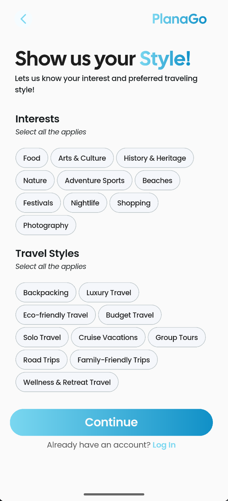
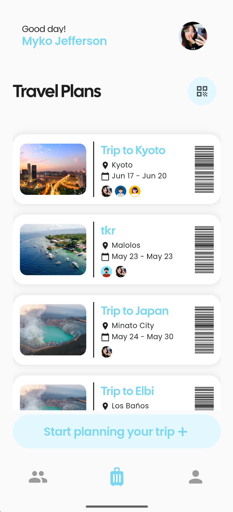
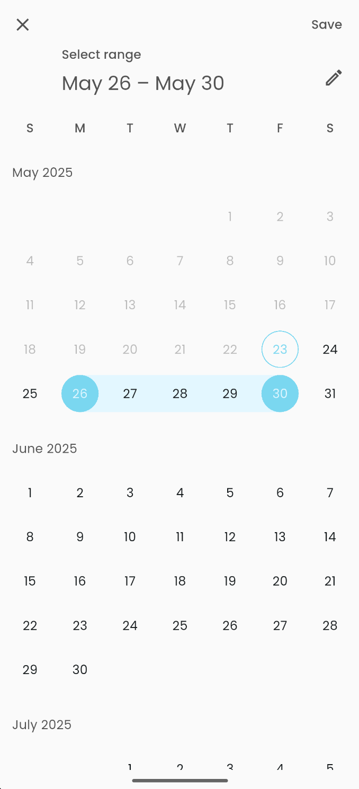

#  **PlanAgo**
**Your Personalized Travel Planner**

**PlanAgo** is a _beautifully crafted_ travel planning app built with **Flutter** and **Firebase**. Whether you’re a solo traveler or an adventure squad, PlanAgo helps you create, share, and manage your perfect trips—effortlessly.

---

## 📱 About the App

PlanAgo allows users to:

- ✨ Create and manage travel plans with locations, dates, and additional details
- 🧳 Add flights, accommodations, checklists, and daily itineraries  
- 🔍 Find fellow travelers with similar travel styles and interests  
- 📸 Customize their profile with pictures, interests, and travel styles  
- 🤝 Share travel plans via QR code or username  
- 🔔 Get notified before a trip (push notifications)

---

## 🔐 Features

### Travel Plan Management
- Create **personalized** trips with a **custom title**, **flexible date range**, and **precise location selection** using **Google Maps integration**
- Add **comprehensive** travel details including **flight information**, **comfortable accommodations**, **actionable checklists**, and **important notes**
- Build **detailed daily itineraries** featuring **specific locations**, **planned activities**, and **estimated expenses** for a well-organized travel experience
- Share travel plans effortlessly through a **secure QR code** or by direct sharing to a **follower**

### Social Discovery
- Discover users with similar travel interests or styles
- View public user profiles
- Follow fellow travelers
- Privacy controls to manage profile visibility

### Profile Customization
- Upload and update profile pictures
- Edit personal information such as name, phone number, interests, and travel styles

### Notifications
- Push notifications to remind users of upcoming trips


---

## 🚀 Installation Guide

### Download via APK (for Android Devices)
Follow this link to be redirected to the APK installer of the app:
[APK Installer 🩵✨]()

### Download through GitHub
1. Clone the repo  
   ```bash
   git clone https://github.com/CMSC23-CD-1L-AY2024-2025-2ndSem/project-giovann_myko_jaco-et-al.git
   cd project-giovann_myko_jaco-et-al
   ```

2. Install Flutter dependencies  
   ```bash
   flutter pub get
   ```

3. Configure Firebase  
   - Follow Firebase setup for Android and iOS
   - Add your `google-services.json` and `GoogleService-Info.plist`  

4. Connect your device
   - Enable developer options in your personal device
   - Ensure that USB debugging and allow install over USB options are toggled
   - Select in VSCode the device where you want the app to be installed

5. Run the app  
   ```bash
   flutter run
   ```

---

## 🛠️ Technologies Used

- **Flutter** for cross-platform mobile development  
- **Firebase Auth** for login/signup  
- **Cloud Firestore** for database  
- **GetX** for state and route management

---

## 📸 Screenshots  
<table align="center">
  <tr>
    <td align="center">
      <br/>
      <strong>Splash Screen</strong>
    </td>
    <td align="center">
      <br/>
      <strong>Login Screen</strong>
    </td>
    <td align="center">
      <br/>
      <strong>Google Login</strong>
    </td>
  </tr>
</table>
<table align="center">
  <tr>
    <td align="center">
      <br/>
      <strong>Sign Up Screen 1</strong>
    </td>
    <td align="center">
      <br/>
      <strong>Sign Up Screen 2</strong>
    </td>
    <td align="center">
      <br/>
      <strong>Sign Up Screen 3</strong>
    </td>
  </tr>
</table>
<table align="center">
  <tr>
    <td align="center">
      <br/>
      <strong>Avatar Selection</strong>
    </td>
    <td align="center">
      <br/>
      <strong>Travel Plan Screen</strong>
    </td>
    <td align="center">
      <br/>
      <strong>Travel Plan Overview</strong>
    </td>
  </tr>
</table>
<table align="center">
  <tr>
    <td align="center">
      <br/>
      <strong>QR Code Sharing</strong>
    </td>
    <td align="center">
      <br/>
      <strong>QR Code Scanner</strong>
    </td>
    <td align="center">
      <br/>
      <strong>Itinerary Screen</strong>
    </td>
  </tr>
</table>
<table align="center">
  <tr>
    <td align="center">
      <br/>
      <strong>Create a Plan</strong>
    </td>
    <td align="center">
      <br/>
      <strong>Location Picker</strong>
    </td>
    <td align="center">
      <br/>
      <strong>Date Picker</strong>
    </td>
  </tr>
</table>
<table align="center">
  <tr>
    <td align="center">
      <br/>
      <strong>Find Similar People</strong>
    </td>
    <td align="center">
      <br/>
      <strong>View Other Profile</strong>
    </td>
    <td align="center">
      <br/>
      <strong>Search Users</strong>
    </td>
  </tr>
</table>
<table align="center">
  <tr>
    <td align="center">
      <br/>
      <strong>Profile Page</strong>
    </td>
    <td align="center">
      <br/>
      <strong>Edit Profile Page</strong>
    </td>
    <td align="center">
      <br/>
      <strong>PlanAgo</strong>
    </td>
  </tr>
</table>


---

## 🩵 Acknowledgments

This project is developed as part of an academic course. Special thanks to the our course inctructors Mr. Aldrin Hao and Ms. Abigail Nadua~! 🩵 

---

## 🩵 License

This project is for educational purposes only and is not intended for commercial use. All of the images and resources used in this project are license-free and open for non-commercial use.

## Contributors

<ul>
  <li>
    <a href="https://github.com/mmjavier" target="_blank">
      
      <strong>@mmjavier</strong> — <em>BS Computer Science Student | UPLB</em>
    </a>
  </li>
  <li>
    <a href="https://github.com/GiovannApolinar" target="_blank">
      
      <strong>@GiovannApolinar</strong> — <em>BS Computer Science Student | UPLB</em>
    </a>
  </li>
  <li>
    <a href="https://github.com/ALRnoche" target="_blank">
      
      <strong>@ALRnoche/strong> — <em>BS Computer Science Student | UPLB</em>
    </a>
  </li>
</ul>


